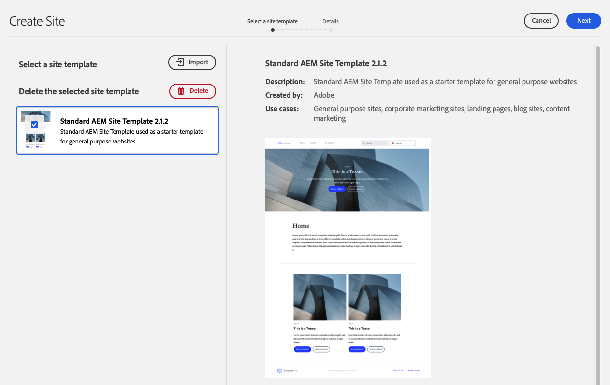

# QSC Template Creation



This is a guide on how to create a new QSC Template, using the Standard Template as the base.

## Prerequisites

Review the required tooling and instructions for setting up a [local development environment](https://experienceleague.adobe.com/docs/experience-manager-learn/getting-started-wknd-tutorial-develop/project-archetype/overview.html?lang=en#local-dev-environment). Ensure that you have a fresh instance of Adobe Experience Manager available locally and that no additional sample/demo packages have been installed (other than required Service Packs).

## Download the Basic Site Template

A Site Template provides a starting point for a new site. A Site Template includes some basic theming, page templates, configurations and sample content. Exactly what is included in the Site Template is up to the developer. Adobe provides a **Basic Site Template** to accelerate new implementations.

1. Open a new browser tab and navigate to the Basic Site [Template project on GitHub](https://github.com/adobe/aem-site-template-standard). The project is open-sourced and licensed to be used by anyone.

2. Click Releases and navigate to the [latest release](https://github.com/adobe/aem-site-template-standard/releases/latest).

3. Expand the Assets dropdown and download the Source Code file:

## Source Code Structure Explained
```
aem-site-template-standard-aem-site-template-standard-x.x.x
│   ...
│
└───files
│       wireframe.xd
│
└───preview
│       StandardSiteTemplate.png
│
└───site
│   │   pom.xml
│   │   ...
│   │
│   └───src
│   │       ...
│   │
│   └───target
│           ...
│
└───theme
    |   env_template
    |   ...
    |   
    └───src
            ...
```

`files` Folder with the UI wireframes and other files supporting current design

`preview` Folder with screenshots of the site template

`site` Base site structure, content and template policies that are copied and used on each site creation from template

`theme` Global template theme responsible for how the site looks (CSS, JS, etc)

## Compile Theme

1. Open terminal in `theme` folder

2. Run `npm install`

3. Run `npm run build`

## Make Local Theme Accessible for Development

1. Open terminal in `theme/dist` folder

2. Run `http-server -p 8888` to start a server on port 8888

## Deploy Site Structure, Content and Template Policies for Development

1. Open terminal in `site` folder

2. Run `mvn clean install`

3. Install `target/xxx.zip` via Package Manager

## Configure Site to Use Local Theme

1. Open browser and navigate to `http://localhost:4502/crx/de`

2. In `CRXDE Lite`, navigate to `/conf/aem-site-template-standard/sling:configs/com.adobe.cq.wcm.core.components.config.HtmlPageItemsConfig/jcr:content`

3. Make backup of `prefixPath` property

4. Change `prefixPath` property to `http://localhost:8888` where local theme is hosted

## Modify Site Structure, Content and Template Policies

1. 

## Export Modified Site Structure, Content and Template Policies

1. 

## Add Modified Site Structure, Content and Template Policies into Template

1. 

## Template Configurations

1. 

## Testing

1. 